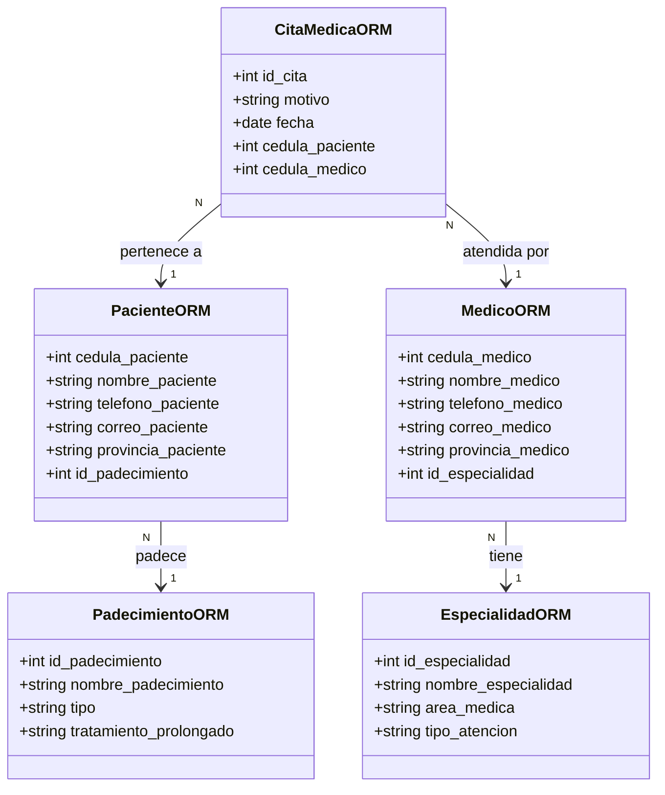

```mermaid
classDiagram
    class EspecialidadORM {
        +int id_especialidad
        +string nombre_especialidad
        +string area_medica
        +string tipo_atencion
    }
    class MedicoORM {
        +int cedula_medico
        +string nombre_medico
        +string telefono_medico
        +string correo_medico
        +string provincia_medico
        +int id_especialidad
    }
    class PadecimientoORM {
        +int id_padecimiento
        +string nombre_padecimiento
        +string tipo
        +string tratamiento_prolongado
    }
    class PacienteORM {
        +int cedula_paciente
        +string nombre_paciente
        +string telefono_paciente
        +string correo_paciente
        +string provincia_paciente
        +int id_padecimiento
    }
    class CitaMedicaORM {
        +int id_cita
        +string motivo
        +date fecha
        +int cedula_paciente
        +int cedula_medico
    }
    MedicoORM "N" --> "1" EspecialidadORM : tiene
    PacienteORM "N" --> "1" PadecimientoORM : padece
    CitaMedicaORM "N" --> "1" PacienteORM : pertenece a
    CitaMedicaORM "N" --> "1" MedicoORM : atendida por
```
